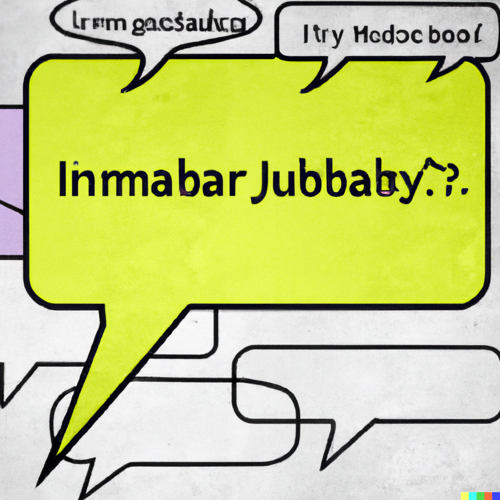

[](https://codecov.io/gh/kevincobain2000/go-gibberish)


<p align="center">
  <a href="https://github.com/kevincobain2000/go-gibberish">
    
  </a>
</p>

<h3 align="center">Gibberish Text Detector in Golang.</h3>

<p align="center">
  Detect meaningless sentences in English language.
  <br>
  How to detect if a text has no meaning?
  <br>
  This package uses a dictionary of words to detect if a text is gibberish or not.
</p>

**Langauges:** English

**Robust** 1:1 dictionary lookup with heauristics.

**Handles** Punctuation, numbers, and etc.

**Performace:** Blazing fast.


## Installation

```sh
go install github.com/kevincobain2000/go-gibberish
```

## USAGE

```go

package main

import (
	"github.com/kevincobain2000/go-gibberish/gibberish"
)

func main() {

	raw := `Yqxdl vyq wklv qrwe vkhu hqfubswlrq lv qrw yhuvlrq vwdwhphqw iru frpplwphqw lq wkh lqwhuqdwlrq dqg lqwhuqdwlrq ri wkh frqwdl`
	j := gibberish.NewGibberish()
	r := j.Detect(raw)

	fmt.Println(r)
        // outputs
        // &gibberish.Gibberish{
        //   ConfidenceThreshhold: 0.750000,
        //     IsGibberish:          false,
        //     Confidence:           0.992366,
        // }    
}

```


### CHANGE LOG

- v1.0 - Initial release includes detection of gibberish text in English language


### ROADMAP

- [ ] Add support for other languages
- [ ] Add support for bigrams for better detection
- [ ] Add support for repeating words